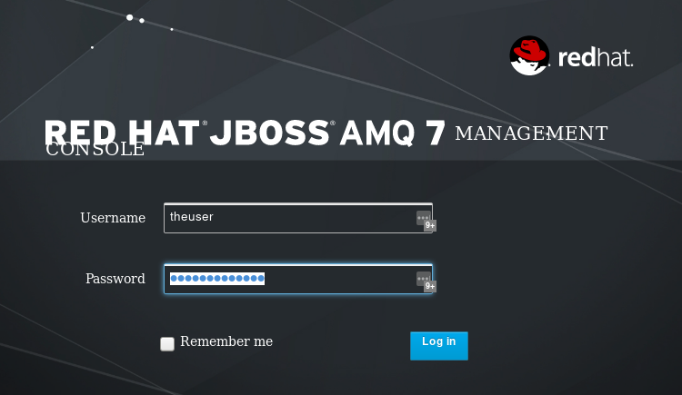
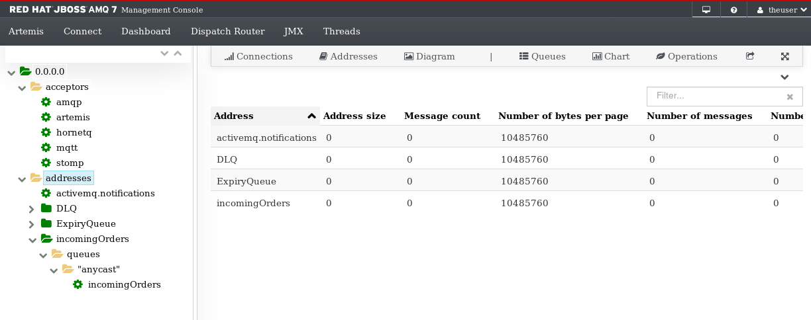
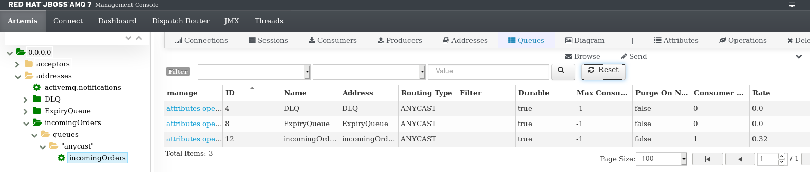

# JBoss AMQ7 and Camel AMQP Example

#### Download AMQ7:

Download AMQ7 broker from [https://developers.redhat.com/download-manager/file/amq-broker-7.2.3-bin.zip](https://developers.redhat.com/download-manager/file/amq-broker-7.2.3-bin.zip)

#### Unzip the broker:

```text
unzip ~/Downloads/amq-broker-7.2.3-bin.zip -d ~/AppServers
```

#### Create the broker:

```text
cd ~/AppServers
./amq-broker-7.2.3/bin/artemis create examplebroker --user theuser --password Thepassword1! --queues incomingOrders --require-login
```

#### Start the broker:

```text
[user@localhost AppServers]$ ./amq-broker-7.2.3/bin/artemis create examplebroker --user theuser --password Thepassword1! --queues incomingOrders --require-login
Creating ActiveMQ Artemis instance at: /home/user/AppServers/examplebroker

Auto tuning journal ...
done! Your system can make 83.33 writes per millisecond, your journal-buffer-timeout will be 12000

You can now start the broker by executing:  

   "/home/user/AppServers/examplebroker/bin/artemis" run

Or you can run the broker in the background using:

   "/home/user/AppServers/examplebroker/bin/artemis-service" start

```

#### Run the Broker:

```text
"/home/user/AppServers/examplebroker/bin/artemis" run
```

Inspect the console: [http://localhost:8161/console](http://localhost:8161/console)

Login with theuser/Thepassword1!



View the addresses:



#### Run this code!

```text
mvn clean package spring-boot:run
```

Console output:

```text
...
  .   ____          _            __ _ _
 /\\ / ___'_ __ _ _(_)_ __  __ _ \ \ \ \
( ( )\___ | '_ | '_| | '_ \/ _` | \ \ \ \
 \\/  ___)| |_)| | | | | || (_| |  ) ) ) )
  '  |____| .__|_| |_|_| |_\__, | / / / /
 =========|_|==============|___/=/_/_/_/
 :: Spring Boot ::        (v1.4.7.RELEASE)
...
14:35:52.391 [AmqpProvider:(1):[amqp://localhost:5672]] INFO  org.apache.qpid.jms.JmsConnection - Connection ID:626b44e0-7da0-4e18-9f8c-812110c1ac25:1 connected to remote Broker: amqp://localhost:5672
14:35:52.391 [CamelMainRunController] INFO  o.a.camel.spring.SpringCamelContext - Route: jms-cbr-route started and consuming from: amqp://incomingOrders
14:35:52.392 [CamelMainRunController] INFO  o.a.camel.spring.SpringCamelContext - Total 2 routes, of which 2 are started.
14:35:52.394 [CamelMainRunController] INFO  o.a.camel.spring.SpringCamelContext - Apache Camel 2.18.1.redhat-000034 (CamelContext: camel) started in 1.123 seconds
14:35:53.408 [Camel (camel) thread #1 - timer://order] INFO  generate-order-route - Generating order order1.xml
14:35:53.495 [Camel (camel) thread #0 - JmsConsumer[incomingOrders]] INFO  jms-cbr-route - Sending order order1.xml to the US
14:35:53.495 [Camel (camel) thread #0 - JmsConsumer[incomingOrders]] INFO  jms-cbr-route - Done processing order1.xml
14:35:56.394 [Camel (camel) thread #1 - timer://order] INFO  generate-order-route - Generating order order2.xml
14:35:56.413 [Camel (camel) thread #0 - JmsConsumer[incomingOrders]] INFO  jms-cbr-route - Sending order order2.xml to the US
14:35:56.414 [Camel (camel) thread #0 - JmsConsumer[incomingOrders]] INFO  jms-cbr-route - Done processing order2.xml
14:35:59.394 [Camel (camel) thread #1 - timer://order] INFO  generate-order-route - Generating order order3.xml
14:35:59.402 [Camel (camel) thread #0 - JmsConsumer[incomingOrders]] INFO  jms-cbr-route - Sending order order3.xml to the US
14:35:59.402 [Camel (camel) thread #0 - JmsConsumer[incomingOrders]] INFO  jms-cbr-route - Done processing order3.xml
```

The AMQ7 console will show a consumer on the `incomingOrders` queue



# Generating the code

This code/project was generated from an archetype:

```text
mvn -DgroupId=com.nullendpoint -DartifactId=camel-amqp-example -Dversion=1.0-SNAPSHOT -DarchetypeGroupId=org.jboss.fuse.fis.archetypes -DarchetypeArtifactId=spring-boot-camel-amq-archetype -DarchetypeVersion=2.2.195.redhat-000026 -DarchetypeRepository=https://repository.jboss.org/ga org.apache.maven.plugins:maven-archetype-plugin:RELEASE:generate
```
## Changes from the Archetype

Application.java

```text
    @Bean(name = "amqp-component")
    AMQPComponent amqpComponent(AMQPConfiguration config) {
        JmsConnectionFactory qpid = new JmsConnectionFactory(config.getUsername(), config.getPassword(), config.getUrl());

        PooledConnectionFactory factory = new PooledConnectionFactory();
        factory.setConnectionFactory(qpid);

        return new AMQPComponent(factory);
    }
```
pom.xml

```text
    <!-- AMQP -->
    <dependency>
      <groupId>org.apache.camel</groupId>
      <artifactId>camel-amqp-starter</artifactId>
    </dependency>

    <dependency>
      <groupId>org.apache.activemq</groupId>
      <artifactId>activemq-jms-pool</artifactId>
    </dependency>
```

The application.properties were swapped out for the application.yml, and an AMQPConfiguration helper class was added.